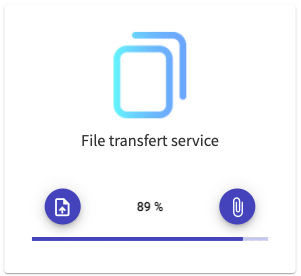

## Description

<p align="center"></p>
Transfert Files enables you to copy files from a desktop or a mobile device to a destination
desktop machine in the same network. The server runs in the destination desktop machine.
The project has a client UI to upload files to the server via multipart/form-data post requests.

## Built with

Server

- [nodejs](https://nodejs.dev/)
- [express.js](https://expressjs.com/)
- [multer](https://www.npmjs.com/package/multer)

Client

- [angular](https://www.npmjs.com/package/@angular/cli)
- [angular material](https://material.angular.io/)

### Installation

1. clone the repository

```sh
git clone https://github.com/ayoub-g/transfert-files.git
```

2. cd to the server folder

```sh
cd transfert-files/server
```

3. install npm dependencies

```sh
npm install
```

4. update destination directories in the file config.json

```json
{
  "_comment": "update destination directories here",
  "storage": {
    "volume": "/Volumes/drive/media",
    "imagesPath": "/images",
    "videosPath": "/videos"
  }
}
```

5. Now we have to configure the UI so we can upload files from another device to the server

The project comes with the pre-built angular UI in the public folder,
to be able to upload files from another device/desktop, we have to setup the server IP. To do this **without rebuilding** the angular project, I have externalized the IP configuration in the file
public/assets/config.json. update it to the address of the server

```sh
cd ..
```

```json
{
  "_comment_": "update server ip here",
  "server": "http://192.168.x.x:3000"
}
```

6.  run the server

```sh
npm start
```

7. finally open a new tab at http://localhost:3000 from the server, or http://192.168.x.x:3000 from
   your device

8. continue if you want to update the UI or rebuild it

```sh
cd frontend
```

9. install npm dependencies

```sh
npm install
```

10. in the dev mode, if you want to change the server port, go to the **proxy.conf.json** file

```json
{
  "/server": {
    "target": "http://localhost:3000"
  }
}
```

11. run the project

```sh
npm start
```

12. open a new tab at http://localhost:4200

## Credits

Project icon

- [flaticon](https://flaticon.com)

  [project-screenshot]: images/screenshot.png
